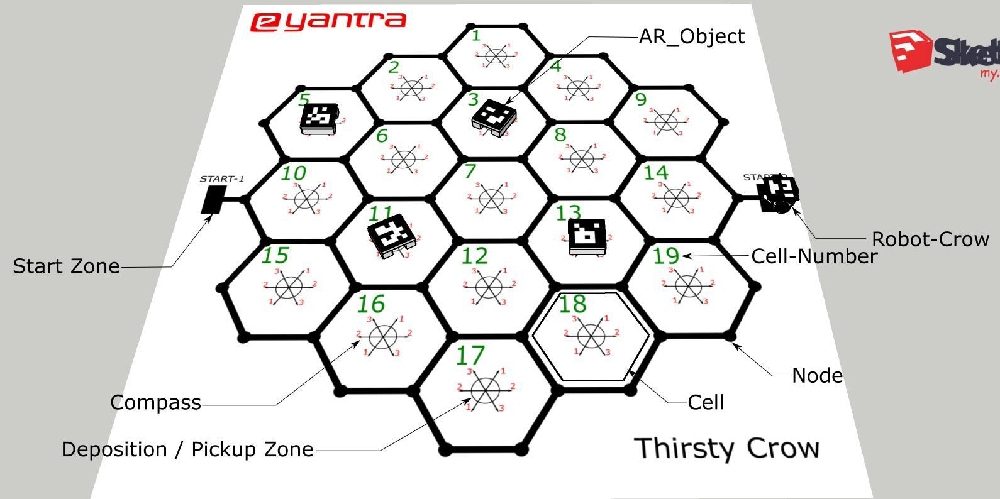
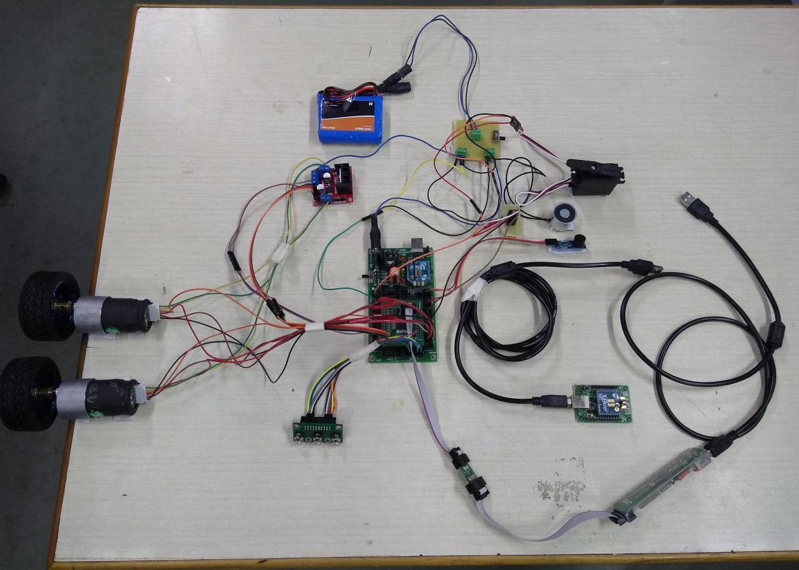
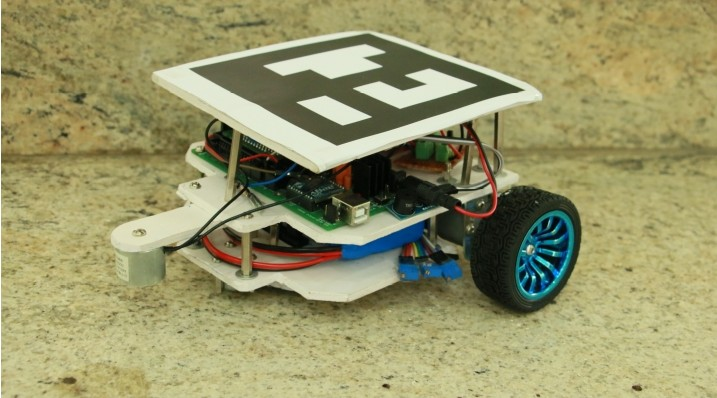
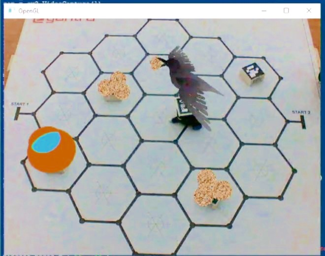
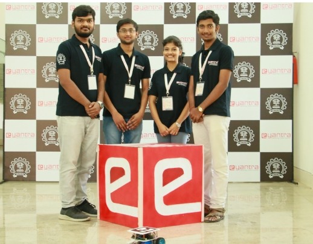

# E-Yantra-Project ( Thirsty Crow )
This is repository for the project done by our team for E-Yantra Robotics Competition 2018

My Team interview at E-Yantra 2018, IIT Bombay  
https://youtu.be/cGEJl10H7wQ 

<h3>About competition</h3>

e-Yantra Robotics Competition (eYRC) is a unique annual competition for undergraduate students in science and colleges. Selected teams are given a robotic kit complete with accessories and video tutorials to help them learn basic concepts in embedded systems and microcontroller programming. Abstracts of real world problems assigned as "themes" are then implemented by the teams using the robotic kits. The theme assigned to the team is <b>"Thirsty Crow"</b>. 

<h3>Thirsty Crow</h3>

The story of Crow and Water Pitcher is one of Aesop’s Fables which everybody has heard in their childhoods. This theme aims to bring this age-old able to life using Augmented Reality with it’s theme - Thirsty Crow. A robot called Crow is deployed in a field where it has to pick up pebbles from different locations in an Arena and drop them at a specific location labeled as Water Pitcher. At the same time, on a virtual screen the story comes to life with the help of AR and special markers. 3D models of Crow, Pebbles and Pitcher (created by teams) are projected on an image of the arena.
 

The aim of the theme is to complete the task in the shortest time possible. The team which deposits all the pebbles in the water pitcher and projects all 3D models correctly will be declared the WINNER.

<h3>Technology Involved</h3>
<ul>
  <li>Image Processing using OpenCV</li>
  <li>Graphics Processing using OpenGL</li>
  <li>Microcontroller Programming</li>
  <li>Blender Model Creation</li>
</ul>

<h3>Project Description

The arena for the project is as follows :
 

 

<h3>Flow of the project</h3>
<ol>
  <li>  Python script is started. The image of arena is projected on screen with 3D models being projected on top of AR_Objects.</li>
  <li>Robot is placed (switched OFF) on either START-1 or START-2 according to configuration. robot is switched ON.</li>
  <li>Robot traverses to each of the Pebble AR_Object locations and picks up the magnetic pebble from under the AR_Object.</li>
  <li>During pebble pickup, augmented reality part shows Pebble Pickup animation.</li>
  <li>After each pebble pickup, robot traverses to Water Pitcher AR_Object to deposit the magnetic pebble in the    deposition/pickup zone under the AR_Object.</li>
  <li>During pebble drop, augmented reality part should show Pebble Drop animation.</li>
  <li>After all magnetic pebbles have been deposited under the Water Pitcher AR_Object, robot will sound the buzzer for 5 seconds to end the task.</li>
 </ol>
 
 <h3>Implementation of Theme</h3>
 
The robotic kit contains following major components : 

 <ul>
 <li>Atemega 2560 Development board</li>
 <li>Xbee module and Adapter</li>
 <li>L298N Motor driver module</li>
 <li>Quadrature encoder motor</li>
 <li>3 segment Line following sensor</li>
 <li>Electromagnet module</li>
 <li>STK 500 programmer</li>
 <li>USB Webcam</li>
 </ul>
 
<h5>ATmega2560 Development Board : </h5>

ATMEGA2560 is the versatile AVR architecture based microcontroller from Atmel featuring 256K Flash, 8K RAM, 86 I/O lines arranged in ten 8-bit ports, 16 ADCs, 4 UARTs, 6 timers, 8 external interrupts and much more. ATmega2560 Development Board exposes all the pins of the microcontroller in neat PORT wise configuration. It is made from double sided PTH PCB board to provide extra strength to the connector joints for increased reliability. Board can work on 7 to 15V AC or DC supply. It has
built-in reverse polarity protection. 7805 voltage regulator has heat sink for heat dissipation so that it can supply 1A current continuously without getting over heated. It has switches for boot loading, reset and power. It also has XBee/USB interface
based on FT232.

<h5>L298N Motor Driver</h5>

This motor controller is based on the L298N heavy-duty dual H-bridge controller,
which can be used to drive two DC motors at upto 2A each, with a voltage between 5
and 35V DC. The controller has fast short-circuit protection diodes, and a heat sink to
keep the motor driver safe.

The final circuit : 

 

The chasis of robot :

 

<h5>Establishing XBee Communication between Microcontroller and Computer</h5>

One of the important requirements in this theme is to establish XBee communication between the computer system (on which python code will run) and the ATMEGA2560 microcontroller board (situated on the robot). We will use AVR UART programming and PySerial library to implement the same in this task.

<h5>Path Planning Algorithm</h5>

The path planning algorithm is designed as all the pebble pick-up and drop are done in shortest path. The arena is divided into rows and columns. Every node can be represented as the (row number, column number) pair.The algorithm depends on previous node position, current node position and destination node position. The next node is calculated from these three parameters.  From previous node position, current node position, next node position the direction to which robot to turn is calculated.This gives shortest path between any two nodes.

<h4>The Augmented Reality implementation :</h4>
<h5>Detection of the ArUco Markers :</h4>

ArUco is an easy to use Python library for detection of ArUco markers. The image taken from the webcam is stored as grey scale image by using OpenCV library. The ID and positions of these markers are detected and stored. After this the orientation of the markers is calculated from camera matrix, distortion matrix and the position of the detected marker. The poistion and orientation are converted into vectors for projection of the 3D models.

<h5>Projection of the blender models :</h5>

The 3D models of pebble, pitcher and bird are created in the Blender software. The blender files are imported in the python by objloader. The imported 3D models are projected on the detected ArUco markers using OpenGL library functions. The different animations such as pebble pickup, pebble drop and crow flying is shown.</h5>

Finally the OpenGL screen looks like : 

 

Thus, the project is implemented.

<h4>Team :</h4>

 

